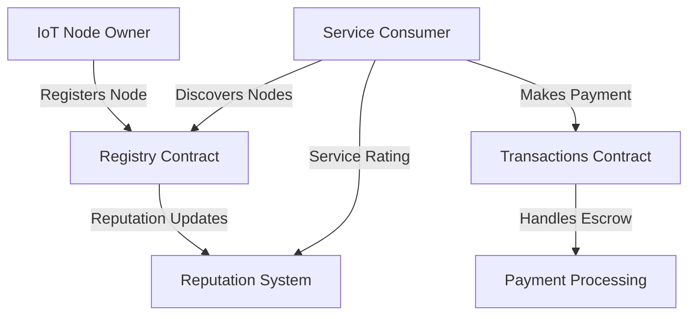

# LoopNode IoT Management

A decentralized system for registering, managing, and coordinating Internet of Things (IoT) devices through the Stacks blockchain.

## Overview

LoopNode enables IoT device owners to register their nodes, specify capabilities, and make them discoverable to potential users seeking specific IoT services. The system creates a trustless environment where:

- IoT node operators can earn rewards for providing data or computing services
- Consumers can discover and utilize IoT resources with transparent reputation tracking
- Payments and service agreements are handled securely through smart contracts
- Quality and reliability are ensured through an on-chain reputation system

## Architecture

The system consists of two main smart contracts that handle different aspects of the platform:



### Core Contracts

1. **loopnode-registry.clar**
   - Handles node registration and management
   - Maintains node metadata and capabilities
   - Manages reputation and ratings system
   - Enables node discovery and categorization

2. **loopnode-transactions.clar**
   - Manages economic transactions between parties
   - Handles payment processing and escrow
   - Manages subscriptions and dispute resolution
   - Implements multiple payment models

## Contract Documentation

### Registry Contract (loopnode-registry.clar)

#### Key Features
- Node registration and metadata management
- Capability and service type tracking
- Reputation system with user ratings
- Category-based node discovery

#### Main Functions
```clarity
(register-node (node-id string-ascii) ...)
(update-node-status (node-id string-ascii) (status string-ascii))
(rate-node (node-id string-ascii) (rating uint) (review optional-string))
```

### Transactions Contract (loopnode-transactions.clar)

#### Key Features
- Multiple payment models (pay-per-use, subscription)
- Escrow payment handling
- Dispute resolution system
- Subscription management

#### Main Functions
```clarity
(pay-for-service (service-id uint) (amount uint))
(subscribe-to-service (service-id uint) (duration uint))
(complete-service (payment-id uint))
(file-dispute (payment-id uint) (reason string-ascii))
```

## Getting Started

### Prerequisites
- Clarinet installed for local development
- Stacks wallet for deployment and testing
- Basic understanding of Clarity and blockchain concepts

### Installation
1. Clone the repository
2. Install dependencies with Clarinet
```bash
clarinet integrate
```

### Basic Usage

1. **Register an IoT Node**
```clarity
(contract-call? .loopnode-registry register-node 
    "node123" 
    "Temperature Sensor" 
    "Environmental monitoring sensor"
    50 
    -73 
    "North America"
    "online"
    (list "temperature" "humidity")
    (list "monitoring" "alerts")
    "per-request"
    (list "environmental" "weather"))
```

2. **Make a Payment for Service**
```clarity
(contract-call? .loopnode-transactions pay-for-service 
    u1 ;; service-id 
    u1000) ;; amount in microSTX
```

## Function Reference

### Registry Functions

| Function | Description | Parameters |
|----------|-------------|------------|
| register-node | Registers a new IoT node | node-id, name, description, location, capabilities |
| update-node-status | Updates node status | node-id, new-status |
| rate-node | Rates a node's service | node-id, rating, review |

### Transaction Functions

| Function | Description | Parameters |
|----------|-------------|------------|
| pay-for-service | Makes one-time payment | service-id, amount |
| subscribe-to-service | Creates subscription | service-id, duration |
| file-dispute | Files service dispute | payment-id, reason |

## Development

### Testing
Run the test suite:
```bash
clarinet test
```

### Local Development
1. Start Clarinet console:
```bash
clarinet console
```

2. Deploy contracts:
```bash
clarinet deploy
```

## Security Considerations

### Access Control
- Node operations restricted to registered owners
- Payment operations verified against service agreements
- Dispute resolution limited to authorized parties

### Payment Safety
- Escrow system for payment protection
- Multiple confirmation steps for service completion
- Dispute resolution mechanism for conflicts

### Limitations
- Platform fees are fixed at deployment
- Dispute resolution requires trusted arbitrators
- Maximum limits on various operations (e.g., ratings, categories)